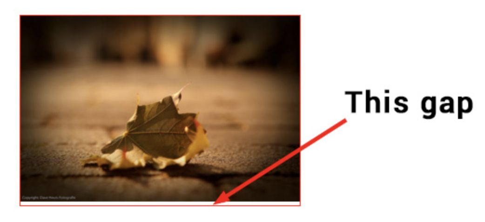

## Problem

```
<div id="wrapper">
  
</div>
```




## Answer

By default, an image is rendered inline, like a letter so it sits on the same line that a, b, c and d sit on.
There is space below that line for the descenders you find on letters like g, j, p and q.

You can:
- adjust the vertical-align of the image to position it elsewhere (e.g. the middle) or
- change the display so it isn't inline.
