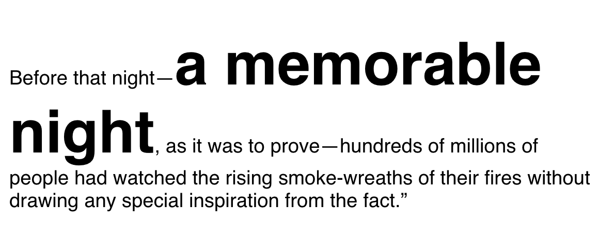

# CSS Flow Layout (Normal Flow)

[ref](https://developer.mozilla.org/en-US/docs/Web/CSS/CSS_Flow_Layout/Block_and_Inline_Layout_in_Normal_Flow)

Normal Flow, or Flow Layout, is the way that Block and Inline elements are displayed on a page before any changes are made to their layout. 

Normal Flow has a very tied origin with how we visually format text in a language - as in the early day HTML is used as a document.

In normal flow, inline elements display in the inline direction, that is in the direction words are displayed in a sentence according to the Writing Mode of the document. Block elements display one after the other, as paragraphs do in the Writing Mode of that document. In English therefore, inline elements display one after the other, starting on the left, and block elements start at the top and move down the page.

Any boxes in normal flow will be part of a formatting context. They can be either block or inline, but not both at once. We describe block-level boxes as participating in a block formatting context, and inline-level boxes as participating in an inline formatting context.


## Block formatting context

By default block elements will consume all of the space in the inline direction, so our paragraphs spread out and get as big as they can inside their containing block. If we give them a width, the will continue to lay out one below the other - even if there would be space for them to be side by side. Each will start against the start edge of the containing block, so the place at which sentences would begin in that writing mode.


## Inline formatting context

Inline elements display one after the other in the direction that sentences run in that particular writing mode. While we don’t tend to think of inline elements as having a box, as with everything in CSS they do. These inline boxes are arranged one after the other. If there is not enough space in the containing block for all of the boxes a box can break onto a new line. The lines created are known as line boxes.

In the following example we have three inline boxes created by a paragraph with a strong element inside it.



```html
<p>Before that night—<strong>a memorable night</strong>, as it was to prove—hundreds of millions of people had watched the rising smoke-wreaths of their fires without drawing any special inspiration from the fact.”</p>
```

## The display property and flow layout

The display type of an element defines the outer display type, this dictates how the box displays alongside other elements in the same formatting context. It also defines the inner display type, which dictates how boxes inside this element behave. We can see this very clearly when considering a flex layout. In the example below I have a div, which I have given `display: flex`. The flex container behaves like a block element, it displays on a new line and takes up all of the space it can in the inline direction. This is the outer display type of block.


## The Formatting Context


https://developer.mozilla.org/en-US/docs/Web/CSS/CSS_Flow_Layout/Formatting_Contexts_Explained

The html element defines the initial Block Formatting Context (BFC) for your page. This means all the elements inside <html></html> lay themselves out according to Normal Flow following the rules for block and inline layout. Elements participating in a BFC use the rules outlined by the CSS Box Model, which defines how an element's margins, borders and padding interact with other blocks in the same context.


